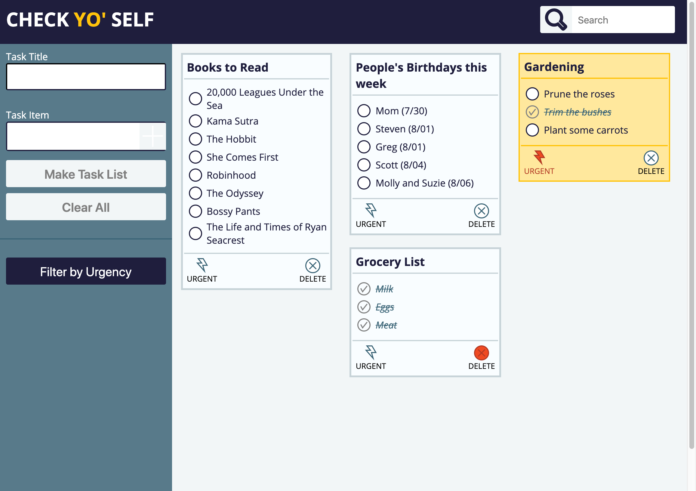
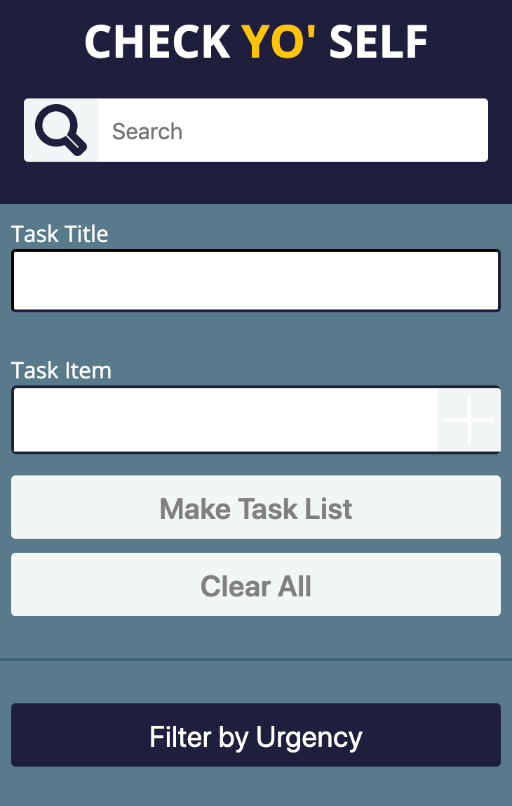

# Check Yo' Self

## Introduction

Check Yo' Self is my first solo project. In this project I was given a few static comps lining out mobile and desktop layouts as well as the needed functionality. In this project I used HTML, CSS and two separate JavaScript files. One of the JavaScript files contained the majority of the functionality that affected the DOM and the other held my ToDoList class which aided in updating the necessary data model.

## Overview

Check Yo' Self allows users to make To-do lists by giving each list a title as well as well as adding individual tasks. Once the list has been created users can then mark the specific lists as urgent, and mark of each task (in any order). They may only delete the list once all of the tasks are complete. They can also filter and show only their urgent lists and then search only those urgent lists. They can also search for the title of a specific list in the search bar in the upper right-hand corner. All of the changes the users make will persist upon page loads and should also persist if the site is revisted later using the same browser.

## Live Page

[Here](https://sschipke.github.io/checkyoself/) is a link to my live Check Yo' Self web page!

## Screen Shots

### Comp

### Build

